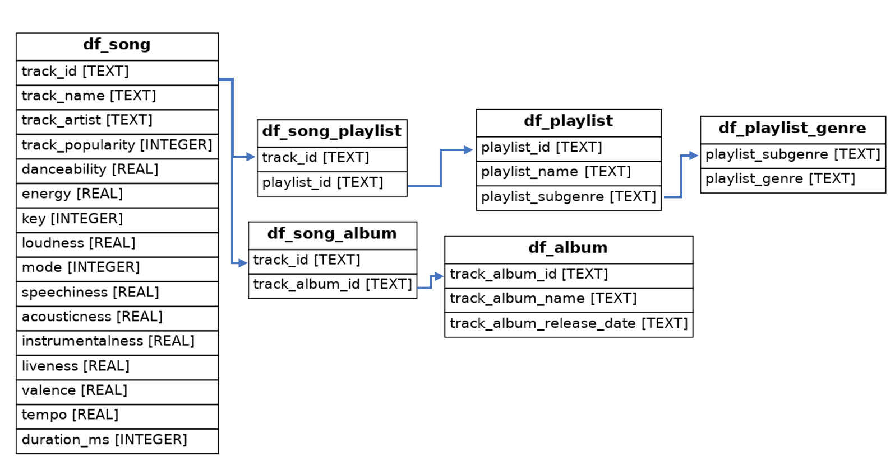

# spotify_sql
Download the [Spotify songs data set](https://github.com/rfordatascience/tidytuesday/blob/master/data/2020/2020-01-21/readme.md) and create a SQLite3 database to store this data in the 3rd normal form (3NF), and populate the tables.
 

